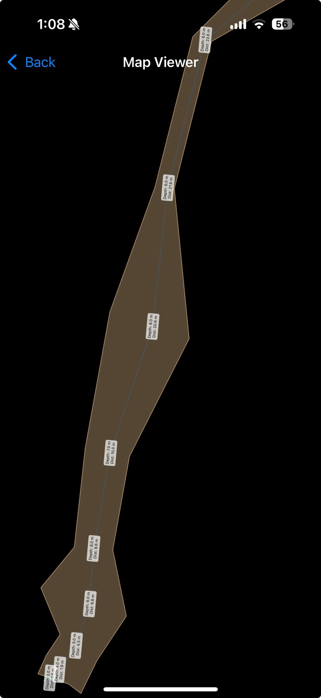

IOS APP designed for Iphone which uses a waterproof case for the phone and 3d printed wheel with a magnet to measure lines in underwater caves.

Concept:
The app uses the magnetometer to detect the proximity of a magnet on a wheel.
The wheel is clamped around the cave diving line and rotates as the diver moves the device forward.
Each rotation the app detects the peak magnetic field value and by knowing the diameter/circumference of the wheel masures the distance traveled along the line.

The app then saves a data point each rotation with the following data: point number, compass heading, distance ( total from the first point ), depth ( user can adjust via 2 buttons on the dive case ).

The app has also manual points which are added by the diver on each tieoff point.

The survey data can be exported in CSV and shared via IOS share opitons.

There is also option to view a live map for reference during the dive.

Credits: Code entirely written by ChatGPT. I don't code on SWIFT language or IOS.

The device:
The app requires a 3d printed device which is attached to an iphone dive case.
The device contains the measuring wheel and guideline clamp mechanism.

My goals for the device:
I wanted the device to be fully 3d printable, so you can make it in any place where there is a 3d printer available. 
No springs or screws, nuts or other hardware required.

Currently, only non 3d printed parts needed are:
- Rubber band for keeping the slider gate clamped down/tensioned on the cave line.
- small magnet 8mm in diameter. ( available in hardware stores )
If you have a bigger magnet, you can drill out the hole bigger or melt it or glue it on the wheel whatever works.

App is now available in app store:
https://apps.apple.com/bg/app/cavedivemap/id6743342160

STL files for the measurement wheel device available at:
https://www.thingiverse.com/thing:6950056

Dive Case I use for iphone 15:
https://hz.aliexpress.com/i/1005005277943648.html?src=google&albch=search&acnt=479-062-3723&isdl=y&aff_short_key=UneMJZVf&albcp=266121556&albag=7593673036&slnk=&trgt=dsa-42862830006&plac=&crea=426823514858&albad=426823514858&netw=g&device=c&mtctp=&memo1=&albbt=Google_7_search&aff_platform=google&albagn=888888&isSmbActive=false&isSmbAutoCall=false&needSmbHouyi=false&gad_source=1&gclid=CjwKCAiAtsa9BhAKEiwAUZAszdImIvknDFVuMjy0B4ktC4mgl3NdYCsqJR2yrvNp2XDpOteMqIDGphoCJgsQAvD_BwE

The app in run mode:

The example live map view:

